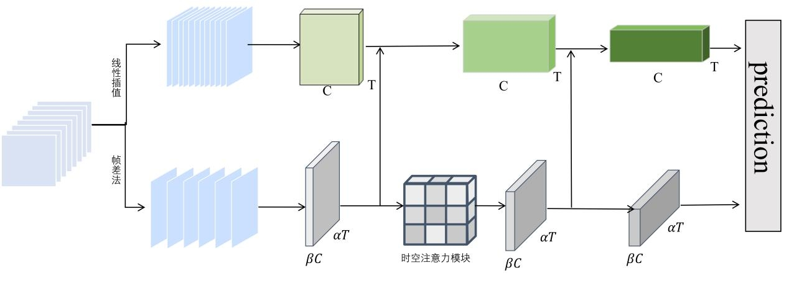

# STFM-SlowFast
Paper code: Research on Violent Video Behavior Recognition Method Based on Improved SlowFast

## Environment
Ubuntu20.04
Python 3.8
PyTorch 1.11.0 + Cuda 11.3

## Dataset
The dataset we are using are Bullying10k and UCF101
The Bullying10k dataset can be obtained from https://pan.baidu.com/s/1AHQKqEPlkvbg4es2lAYcZQ?pwd=2hoy
